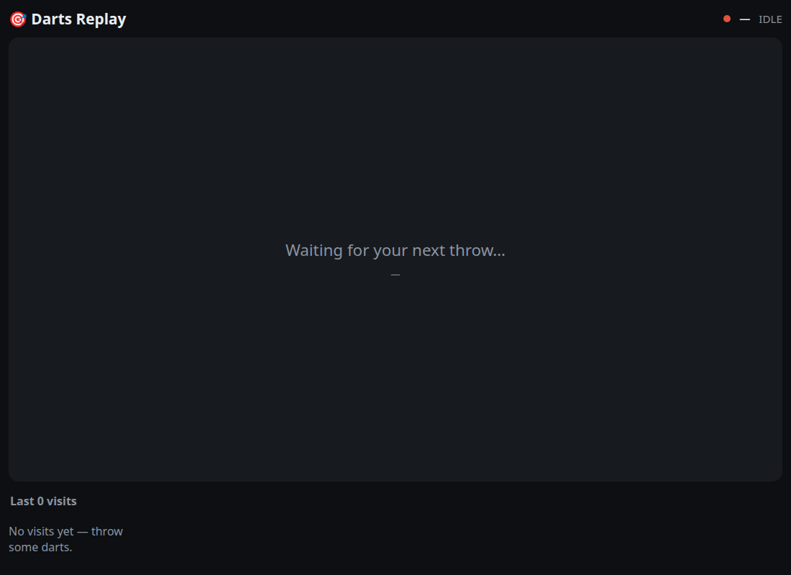
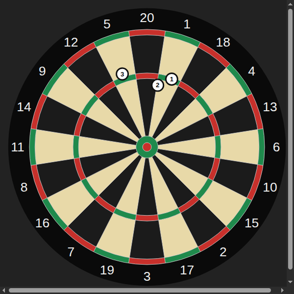

# darts-replay

[](https://github.com/Vaevictus/darts-replay/actions/workflows/ci.yml)
[](LICENSE)
[](.nvmrc)

**Instant replay for your [Autodarts](https://autodarts.io) board.** A spare webcam records you
throwing; the moment a visit (up to 3 darts) finishes, the clip **auto-plays** in your browser,
paired with a precise SVG of exactly what you hit. Collect your darts, and after a short timeout it
re-arms for the next visit.

> **Linux only.** It uses V4L2 capture, a tmpfs ring buffer (`/dev/shm`) and `ffmpeg`. It runs
> happily on the same mini-PC/Raspberry-Pi-class box as your Autodarts board manager.

| Auto-replay UI | Rendered board (from the API coordinates) |
| --- | --- |
|  |  |

## Features

- 🎥 **Automatic per-visit clips** — continuous capture, instant stream-copy clips (no waiting).
- ⚡ **Hands-free** — driven entirely by the Autodarts board state; no buttons to press.
- 🎯 **Exact SVG board** — each replay shows where the darts landed, from the board's own coordinates.
- 🖼️ **Review gallery** — scrub back through the last N visits.
- 🪶 **Light** — `libx264 ultrafast` at 720p30 costs ~0.7 of one core; the board detection is untouched.

## How it works

```
 spare webcam ──ffmpeg──▶ 1s TS segments (tmpfs ring)
                              │  stream-copy concat on visit finish
 autodarts :3180 ──poll──▶ board adapter ──signals──▶ visit FSM ──▶ clip.mp4
 (/api/state)                                            │
                                                         ▼
                              Fastify  ──REST + /ws──▶ React web app
                              /clips, SPA               (auto-replay + gallery + SVG board)
```

The Autodarts **Board Manager** exposes `GET http://localhost:3180/api/state` (status, throw count,
and per-dart segment + normalized coordinates). darts-replay polls it (~150 ms; there is no
websocket), runs the snapshots through a small visit state machine, and asks the recorder for a clip
when the visit ends. See [ARCHITECTURE.md](ARCHITECTURE.md) for the full design.

## Install

Three ways to install — see **[INSTALL.md](INSTALL.md)** for the full details.

- **`.deb` (Debian/Ubuntu)** — self-contained (bundles Node; only needs `ffmpeg`), installs a
  system service. Grab it from the [latest release](https://github.com/Vaevictus/darts-replay/releases/latest):
  ```sh
  sudo apt install ./darts-replay_<version>_amd64.deb
  sudoedit /etc/darts-replay/config.json && sudo systemctl start darts-replay
  ```
- **Container (rootless podman)** — multi-arch image on `ghcr.io/vaevictus/darts-replay`, driven by
  [`docker-compose.yml`](docker-compose.yml); auto-start as a `--user` service via
  [deploy/README.md](deploy/README.md):
  ```sh
  mkdir -p config data && cp config.example.json config/config.json   # then edit
  podman compose up -d          # open http://localhost:8787
  ```
- **From source** — see [Develop](#develop) below.

Every method needs a **spare V4L2 webcam** and the Autodarts **Board Manager** on `:3180`.

## Requirements

- **Linux** x86_64 / arm64 (V4L2, `/dev/shm`).
- **Node.js ≥ 20** and **`ffmpeg`** on `PATH` (the `.deb` and container bundle these for you).
- A running **Autodarts Board Manager** reachable on `:3180` (default: localhost).
- A **spare V4L2 webcam** *separate from the cameras Autodarts uses for detection* — V4L2 capture
  devices can't be shared between two processes. MJPEG-capable is ideal. Find yours with
  `v4l2-ctl --list-devices`.

## Develop

```sh
git clone https://github.com/Vaevictus/darts-replay.git
cd darts-replay
npm install
cp config.example.json config.json     # then edit (see Configuration)
npm run dev                            # server :8787 + Vite dev :5173 (hot reload)
```

For production, build the SPA and run the single server:

```sh
npm run build
npm start                              # serves UI + API on :8787
# open http://localhost:8787 in a browser on the box
```

Run `npm run probe` to print the live board events (handy for confirming your board is detected).

### Deploy to a separate box

```sh
scripts/deploy.sh user@your-box        # rsync + npm install + build over SSH
ssh user@your-box 'cd darts-replay && npm start'
```

To auto-start on boot, install the bundled `systemd/darts-replay.service` as a `--user` unit — the
exact command is printed at the end of `scripts/deploy.sh`.

## Configuration

Copy `config.example.json` to `config.json` and edit. If `config.json` is absent the built-in
defaults are used. The two values you'll most likely need to change are **`webcam.device`** and
**`board.host`**.

| Key | Default | Notes |
| --- | --- | --- |
| `board.host` / `board.port` | `127.0.0.1` / `3180` | Autodarts Board Manager address. |
| `board.pollIntervalMs` | `150` | How often to poll `/api/state`. |
| `webcam.device` | `/dev/video6` | **Machine-specific** — your spare camera's capture node. |
| `webcam.width`/`height`/`fps` | `1280`/`720`/`30` | Capture resolution. |
| `webcam.format` | `mjpeg` | V4L2 input format (`mjpeg`, `h264`, `yuyv422`). |
| `webcam.encoder` | `x264` | `x264` (recommended), `copy` (only if the cam emits proper PTS), or `vaapi`. |
| `recorder.segmentDir` | `/dev/shm/darts-replay/ring` | tmpfs ring (kept in RAM). |
| `recorder.ringSeconds` | `90` | Ring buffer depth. |
| `recorder.preRollMs` / `postRollMs` | `1200` / `1200` | Clip padding around the visit. |
| `visit.thirdDartGraceMs` | `600` | Settle time before locking on the 3rd dart. |
| `visit.collectTimeoutMs` | `4000` | Wait after you pull the darts before re-arming. |
| `visit.inactivityTimeoutMs` | `12000` | Fallback finish if a visit stalls. |
| `retainCount` | `12` | Visits/clips to keep. |
| `server.port` | `8787` | HTTP/WebSocket port. |

Set `LOG_LEVEL=debug` for verbose server logs.

## Commands

```sh
npm run dev        # server (tsx watch) + Vite dev with proxy
npm start          # production: serves built SPA + API on :8787
npm run build      # build the web bundle into web/dist
npm run probe      # log live board events
npm run verify     # lint + typecheck + test + build (the pre-PR gate)
```

## Troubleshooting

- **`ffmpeg not found`** — install it (`sudo apt install ffmpeg`). The server fails fast on startup if it's missing.
- **Camera busy / can't open device** — the device is held by Autodarts or another app. Use a *separate* camera and point `webcam.device` at its capture node (`v4l2-ctl --list-devices`).
- **Clips are the wrong length / mis-cut** — your camera's native H.264 likely has no timestamps. Keep `webcam.format: "mjpeg"` and `webcam.encoder: "x264"` (the default), which re-encodes with correct timing.
- **VAAPI errors (`Device creation failed`)** — hardware encode isn't available; use `encoder: "x264"`.
- **No visits appear / status stuck on `Stopped`** — start a game so the board enters detection; confirm `curl http://<board-host>:3180/api/state` returns JSON.

## Security

darts-replay binds `0.0.0.0:<port>` with **no authentication** — run it only on a trusted LAN. See
[SECURITY.md](SECURITY.md).

## Contributing

PRs welcome — see [CONTRIBUTING.md](CONTRIBUTING.md). The pre-PR gate is `npm run verify`.

## License

[MIT](LICENSE) © Craig Whitcombe
